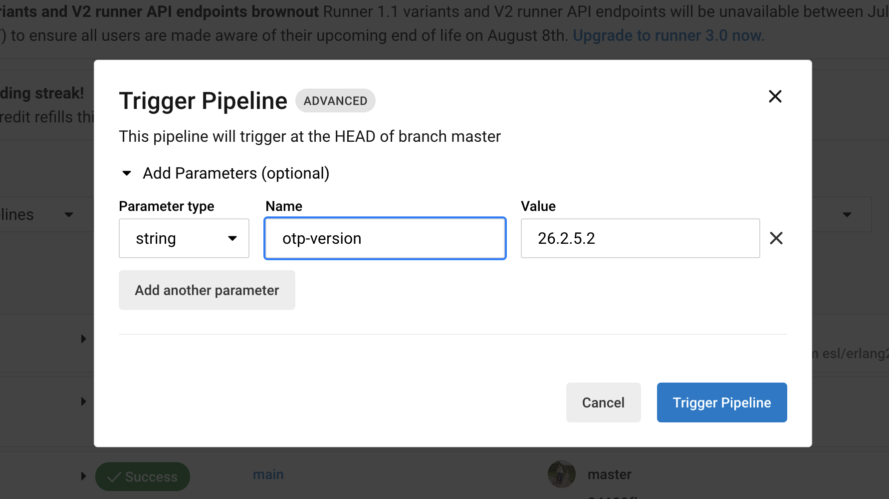

# cimg-erlang
Docker images for CircleCI with Erlang/OTP.

CircleCI provides only [cimg-elixir](https://circleci.com/docs/circleci-images/#elixir), which includes Erlang, but it is only for the `amd64` architecture, and Erlang versions are often not up to date.

There are two ways to use an Erlang image:
* Use [`mongooseim/cimg-erlang`](https://hub.docker.com/repository/docker/mongooseim/cimg-erlang) directly in a docker executor.
* Build it for a specific version of Erlang on your own:

```bash
$ ./build.sh 25.2.3
```

# Trigger build using "Trigger pipeline" on CircleCI

Go to the CircleCI project page, select branch: [CircleCI](https://app.circleci.com/pipelines/github/esl/cimg-erlang?branch=master).

Press the button:


Fill the parameters:


